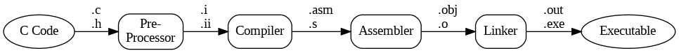

## 99 Bottles of Beer

> 99 bottles of beer on the wall, 99 bottles of beer.
> Take one down and pass it around, 98 bottles of beer on the wall.
>
> 98 bottles of beer on the wall, 98 bottles of beer.
> Take one down and pass it around, 97 bottles of beer on the wall.
>
> [...]
>
> 2 bottles of beer on the wall, 2 bottles of beer.
> Take one down and pass it around, 1 bottle of beer on the wall.
>
> 1 bottle of beer on the wall, 1 bottle of beer.
> Take one down and pass it around, no more bottles of beer on the wall.
>
> No more bottles of beer on the wall, no more bottles of beer.
> Go to the store and buy some more, 99 bottles of beer on the wall.

[Quelle: nach ["Lyrics of the song 99 Bottles of Beer"](https://www.99-bottles-of-beer.net/lyrics.html) on 99-bottles-of-beer.net]{.origin}


## Test it




## 1. Multiple-Choice

                         --{{0}}--
Quizzes in LiaScript are always associated with double brackets or brackets with parentheses. Only by using this single visual metaphor, we can now create various different types of quizzes. The following pattern resembles a checkbox:

Multiple-choice quizzes are easy in LiaScript?

- [[ ]] No, absolutely not
- [[X]] Yes, definitely
- [[X]] There is no easier way, prove me wrong ;-)


## 2. Single-Choice

               --{{0}}--
If the previous one looked like a checkbox, parentheses look like radio buttons. Bam, we have created a single-choice quiz.

Is it really that simple?

- [(X)] Yes, it is.
- [( )] No, but in an ideal LMS it would.


## 3. Matrix

                --{{0}}--
And if you think of multiple-choice and single-choice quizzes as vectors, sure, you can lay them down to define more complex matrix quizzes.


German articles are weird. Try to guess the right one.

- [[male (der)] (female [die]) [neuter (das)]]
- [    [X]           [ ]             [ ]     ]  Mann - man
- [    ( )           (X)             ( )     ]  Frau - woman
- [    [X]           [ ]             [ ]     ]  Junge - boy
- [    ( )           ( )             (X)     ]  Mädchen - girl
- [    [X]           [X]             [ ]     ]  Paprika - bell pepper
- [    (X)           (X)             (X)     ]  Joghurt - yogurt


## 4. Text-Input

                --{{0}}--
A text-input is basically an input field with a predefined solution.

What did the fish say when it swam into the wall?

[[dam]]


## 5. Selection

                --{{0}}--
A selection is basically an input with multiple options separated by vertical bars, where the correct solution is enclosed in parentheses.


What is the derivative function of $f(x) = x^6$?

[[ $f'(x) = 6$ | ( $f'(x) = 6x^5$ ) | $f'(x) = 5x^6$ ]]


## 6. Gap-Text

                --{{0}}--
Now that you know this pattern, you will see it everywhere and you can use it within all Markdown blocks to turn them into quizzes.


| Verb    | Person    | Präsens werden | Partizip II    | Infinitiv haben/sein |
|---------|:---------:|:--------------:|:--------------:|:--------------------:|
| gehen   | Ich       |  [[ werde  ]]  | [[ gegangen ]] | [[ sein ]].          |
| sage    | Du        |  [[ wirst  ]]  | [[ gesagt ]]   | [[ haben ]].         |
| machen  | Er/Sie/Es |  [[ wird   ]]  | [[ gemacht ]]  | [[ haben ]].         |
| laufen  | Wir       |  [[ werden ]]  | [[ gelaufen ]] | [[ sein ]].          |
| singen  | Ihr       |  [[ werdet ]]  | [[ gesungen ]] | [[ haben ]].         |
| spielen | Sie       |  [[ werden ]]  | [[ gespielt ]] | [[ haben ]].         |

                --{{1}}--
Or, you can combine them with other LiaScript elements to create even more complex ones.

                 {{1 |>}}
The film that I saw [[(that)|those|these|then]] night wasn’t very good.
It was all [[ about ]] a man [[ who ]] built a
time machine so he [[ could ]] travel back in time.
It took him ages and ages [[ to ]] build the machine.


## Imperativ, Hardwarenah: C

``` {.c size="footnotesize"}
 #define MAXBEER (99)
 void chug(int beers);
 main() {
    register beers;
    for(beers = MAXBEER; beers; chug(beers--))  puts("");
    puts("\nTime to buy more beer!\n");
 }
 void chug(register beers) {
    char howmany[8], *s;
    s = beers != 1 ? "s" : "";
    printf("%d bottle%s of beer on the wall,\n", beers, s);
    printf("%d bottle%s of beeeeer . . . ,\n", beers, s);
    printf("Take one down, pass it around,\n");
    if(--beers) sprintf(howmany, "%d", beers); else strcpy(howmany, "No more");
    s = beers != 1 ? "s" : "";
    printf("%s bottle%s of beer on the wall.\n", howmany, s);
 }
```

[Quelle: ["Language C"](https://www.99-bottles-of-beer.net/language-c-116.html) by Bill Wein on 99-bottles-of-beer.net]{.origin}

::: notes
*   Imperativ
*   Procedural

*   Statisches Typsystem
*   Resourcenschonend, aber "unsicher": Programmierer muss wissen, was er tut
*   Relativ hardwarenah

*   Einsatz: Betriebssysteme, Systemprogrammierung
:::


## Imperativ, Objektorientiert: Java

```java
class bottles {
    public static void main(String args[]) {
        String s = "s";
        for (int beers=99; beers>-1;) {
            System.out.print(beers + " bottle" + s + " of beer on the wall, ");
            System.out.println(beers + " bottle" + s + " of beer, ");
            if (beers==0) {
                System.out.print("Go to the store, buy some more, ");
                System.out.println("99 bottles of beer on the wall.\n");
                System.exit(0);
            } else
                System.out.print("Take one down, pass it around, ");
            s = (--beers == 1)?"":"s";
            System.out.println(beers + " bottle" + s + " of beer on the wall.\n");
        }
    }
}
```

[Quelle: ["Language Java"](https://www.99-bottles-of-beer.net/language-java-4.html) by Sean Russell on 99-bottles-of-beer.net]{.origin}

::: notes
*   Imperativ
*   Objektorientiert
*   Multi-Threading

*   Basiert auf C/C++
*   Statisches Typsystem
*   Automatische Garbage Collection
*   "Sichere" Architektur: Laufzeitumgebung fängt viele Probleme ab

*   Architekturneutral: Nutzt Bytecode und eine JVM

*   Einsatz: High-Level All-Purpose Language
:::


## Logisch: Prolog

```prolog
bottles :-
    bottles(99).

bottles(1) :-
    write('1 bottle of beer on the wall, 1 bottle of beer,'), nl,
    write('Take one down, and pass it around,'), nl,
    write('Now they are all gone.'), nl,!.
bottles(X) :-
    write(X), write(' bottles of beer on the wall,'), nl,
    write(X), write(' bottles of beer,'), nl,
    write('Take one down and pass it around,'), nl,
    NX is X - 1,
    write(NX), write(' bottles of beer on the wall.'), nl, nl,
    bottles(NX).
```

[Quelle: ["Language Prolog"](https://www.99-bottles-of-beer.net/language-prolog-965.html) by M\@ on 99-bottles-of-beer.net]{.origin}

::: notes
*   Deklarativ
*   Logisch: Definition von Fakten und Regeln; eingebautes Beweissystem

*   Einsatz: Theorem-Beweisen, Natural Language Programming (NLP), Expertensysteme, ...
:::


## Funktional: Haskell

```haskell
bottles 0 = "no more bottles"
bottles 1 = "1 bottle"
bottles n = show n ++ " bottles"

verse 0   = "No more bottles of beer on the wall, no more bottles of beer.\n"
         ++ "Go to the store and buy some more, 99 bottles of beer on the wall."

verse n   = bottles n ++ " of beer on the wall, " ++ bottles n ++ " of beer.\n"
         ++ "Take one down and pass it around, " ++ bottles (n-1)
                                                 ++ " of beer on the wall.\n"

main      = mapM (putStrLn . verse) [99,98..0]
```

[Quelle: ["Language Haskell"](https://www.99-bottles-of-beer.net/language-haskell-1070.html) by Iavor on 99-bottles-of-beer.net]{.origin}

::: notes
*   Deklarativ
*   Funktional
*   Lazy, pure

*   Statisches Typsystem
*   Typinferenz

*   Algebraische Datentypen, Patternmatching

*   Einsatz: Compiler, DSL, Forschung
:::


## Brainfuck

{width="15%"}

[Quelle: Screenshot of ["Language Brainfuck"](https://99-bottles-of-beer.net/language-brainfuck-2542.html) by Michal Wojciech Tarnowski on 99-bottles-of-beer.net]{.origin}

::: notes
*   Imperativ
*   Feldbasiert (analog zum Band der Turingmaschine)

*   8 Befehle: Zeiger und Zellen inkrementieren/dekrementieren, Aus- und Eingabe, Sprungbefehle
:::


## Programmiersprache Lox

```
fun fib(x) {
    if (x == 0) {
        return 0;
    } else {
        if (x == 1) {
            return 1;
        } else {
            fib(x - 1) + fib(x - 2);
        }
    }
}

var wuppie = fib;
wuppie(4);
```

::: notes
*   Die Sprache "Lox" finden Sie hier: [craftinginterpreters.com/the-lox-language.html](https://www.craftinginterpreters.com/the-lox-language.html)

*   C-ähnliche Syntax
*   Imperativ, objektorientiert, Funktionen als *First Class Citizens*, Closures

*   Dynamisch typisiert
*   Garbage Collector
*   Statements und Expressions

*   (Kleine) Standardbibliothek eingebaut

Die Sprache ähnelt stark anderen modernen Sprachen und ist gut geeignet, um an ihrem
Beispiel Themen wie Scanner/Parser/AST, Interpreter, Object Code und VM zu studieren :)
::::


## Wrap-Up

*   Compiler übersetzen formalen Text in ein anderes Format

\bigskip

*   Berücksichtigung von unterschiedlichen
    -   Sprachkonzepten (Programmierparadigmen)
    -   Typ-Systemen
    -   Speicherverwaltungsstrategien
    -   Abarbeitungsstrategien


<!-- DO NOT REMOVE - THIS IS A LAST SLIDE TO INDICATE THE LICENSE AND POSSIBLE EXCEPTIONS (IMAGES, ...). -->
::: slides
## LICENSE


Unless otherwise noted, this work is licensed under CC BY-SA 4.0.

\bigskip

### Exceptions

Citations of "99 Bottles of Beer" lyrics and programming language examples (license(s) unknown):
*   ["Lyrics of the song 99 Bottles of Beer"](https://www.99-bottles-of-beer.net/lyrics.html) on 99-bottles-of-beer.net (Author unknown, Website hosted by Oliver Schade, Gregor Scheithauer, and Stefan Scheler)
*   ["Language C"](https://www.99-bottles-of-beer.net/language-c-116.html) by Bill Wein on 99-bottles-of-beer.net
*   ["Language Java"](https://www.99-bottles-of-beer.net/language-java-4.html) by Sean Russell on 99-bottles-of-beer.net
*   ["Language Prolog"](https://www.99-bottles-of-beer.net/language-prolog-965.html) by M\@ on 99-bottles-of-beer.net
*   ["Language Haskell"](https://www.99-bottles-of-beer.net/language-haskell-1070.html) by Iavor on 99-bottles-of-beer.net
*   Screenshot of ["Language Brainfuck"](https://99-bottles-of-beer.net/language-brainfuck-2542.html) by Michal Wojciech Tarnowski on 99-bottles-of-beer.net (file [`screenshot_brainfuck_99bottles.png`](https://github.com/Compiler-CampusMinden/CB-Vorlesung-Bachelor/blob/master/lecture/00-intro/images/screenshot_brainfuck_99bottles.png))
:::
