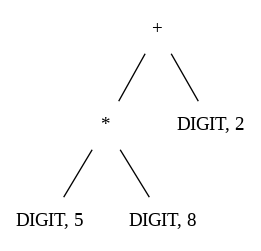
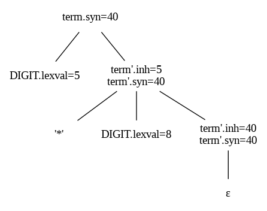

# Motivation

## Ist das alles erlaubt?

Operation erlaubt?

Zuweisung erlaubt?

Welcher Ausdruck hat welchen Typ?

(Welcher Code muss dafür erzeugt werden?)

*   a = b
*   a = f(b)
*   a = b + c
*   a = b + o.nummer
*   if (f(a) == f(b))


## Taschenrechner: Parsen von Ausdrücken wie `3*5+4`

```
expr : expr '+' term
     | term
     ;
term : term '*' DIGIT
     | DIGIT
     ;

DIGIT : [0-9] ;
```

=> Wie den Ausdruck **ausrechnen**?

::: notes

*Anmerkung*: Heute geht es um die einfachste Form der semantischen Analyse: Anreichern einer Grammatik um
Attribute und Aktionen, die während des Parsens oder bei der Traversierung des Parse-Trees ausgewertet
werden.

:::


# Semantische Analyse

## Das haben wir bis jetzt

Wir haben den AST vorliegen.

Idealerweise enthält er bei jedem Bezeichner einen Verweis in sogenannte Symboltabellen (siehe spätere Veranstaltung).

Beim Parsen können schon einige semantische Eigenschaften des zu übersetzenden Programms überprüft werden, falls erforderlich z. B.:

*   Wurden alle Variablen / Objekte vor ihrer Verwendung definiert oder deklariert?
*   Wurden keine Elemente mehrfach definiert?
*   Wurden alle Funktionen / Methoden mit der richtigen Anzahl Parameter aufgerufen? (Nicht in allen Fällen schon prüfbar)
*   Haben Arrayzugriffe auch keine zu hohe Dimension?
*   Werden auch keine Namen benutzt, für die es keine Definition / Deklaration gibt?


## Was fehlt jetzt noch?

Es müssen kontextsensitive Analysen durchgeführt werden, allen voran Typanalysen. Damit der "richtige" (Zwischen-) Code entsprechend den beteiligten Datentypen erzeugt werden kann, muss mit Hilfe des Typsystems der Sprache (aus der Sprachdefinition) überprüft werden, ob alle Operationen nur mit den korrekten Datentypen benutzt werden. Dazu gehört auch, dass nicht nur Typen von z. B. Variablen, sondern von ganzen Ausdrücken betrachtet, bzw. bestimmt werden. Damit kann dann für die Codeerzeugung festgelegt werden, welcher Operator realisiert werden muss (Überladung).


# Analyse von Datentypen

## Typisierung

*   stark oder statisch typisierte Sprachen: Alle oder fast alle Typüberprüfungen finden in der semantischen Analyse statt (C, C++, Java)
*   schwach oder dynamisch typisierte Sprachen: Alle oder fast alle Typüberprüfungen finden zur Laufzeit statt (Python, Lisp, Perl)
*   untypisierte Sprachen: keinerlei Typüberprüfungen (Maschinensprache)


## Ausdrücke

Jetzt muss für jeden Ausdruck im weitesten Sinne sein Typ bestimmt werden.

Ausdrücke können hier sein:

*   rechte Seiten von Zuweisungen
*   linke Seiten von Zuweisungen
*   Funktions- und Methodenaufrufe
*   jeder einzelne aktuelle Parameter in Funktions- und Methodenaufrufen
*   Bedingungen in Kontrollstrukturen


## Statische Typprüfungen

**Bsp.:** Der + - Operator:

| Typ 1. Operand | Typ 2. Operand | Ergebnistyp |
|:--------------:|:--------------:|:-----------:|
| int            | int            | int         |
| float          | float          | float       |
| int            | float          | float       |
| float          | int            | float       |
| string         | string         | string      |


## Typkonvertierungen

*   Der Compiler kann implizite Typkonvertierungen vornehmen, um einen Ausdruck zu verifizieren (siehe Sprachdefiniton).

*   In der Regel sind dies Typerweiterungen, z.B. von *int* nach *float*.

*   Manchmal muss zu zwei Typen der kleinste Typ gefunden werden, der beide vorhandenen Typen umschließt.

*   Explizite Typkonvertierungen heißen auch *Type Casts*.


## Nicht grundsätzlich statisch mögliche Typprüfungen

**Bsp.:** Der ^ - Operator $(a^b)$:

| Typ 1. Operand | Typ 2. Operand | Ergebnistyp |
|:--------------:|:--------------:|:-----------:|
| int            | int $\geq$ 0   | int         |
| int            | int < 0        | float       |
| int            | float          | float       |
| $\ldots$       | $\ldots$       | $\ldots$    |


# Attributierte Grammatiken

## Was man damit macht

Die Syntaxanalyse kann keine kontextsensitiven Analysen durchführen.

*   Kontextsensitive Grammatiken benutzen: Laufzeitprobleme, das Parsen von cs-Grammatiken ist *PSPACE-complete*.

*   Der Parsergenerator *Bison* generiert LALR(1)-Parser, aber auch sog. *Generalized LR (GLR) Parser*, die bei nichtlösbaren Konflikten in der Grammatik (Reduce/Reduce oder Shift/Reduce) parallel den Input mit jede der Möglichkeiten   weiterparsen.

*   Ein weiterer Ansatz, kontextsensitive Abhängigkeiten zu berücksichtigen, ist der Einsatz von attributierten Grammatiken, nicht nur zur Typanalyse, sondern evtl. auch zur Codegenerierung.


# Syntax-gesteuerte Übersetzung: Attribute und Aktionen

<!-- 40 Minuten: 12 Folien (3.0 Min/Folie; inkl. Diskussion) -->

## Berechnen der Ausdrücke

```
expr : expr '+' term ;
```

\bigskip

```
translate expr ;
translate term ;
handle + ;
```


## Attributierte Grammatiken (SDD)

auch "*syntax-directed definition*"

Anreichern einer CFG:

*   Zuordnung einer Menge von Attributen zu den Symbolen (Terminal- und Nicht-Terminal-Symbole)
*   Zuordnung einer Menge von *semantischen Regeln* (Evaluationsregeln) zu den Produktionen


## Definition: Attributierte Grammatik

Eine *attributierte Grammatik* *AG = (G,A,R)* besteht aus folgenden Komponenten:

*   *G = (N, T, P, S)* ist eine cf-Grammatik

*   A = $\bigcup\limits_{X \in (T \cup N)} A(X)$ mit $A(X) \cap A(Y) \neq \emptyset \Rightarrow X = Y$

*   R = $\bigcup\limits_{p \in P} R(p)$ mit $R(p) = \lbrace X_i.a = f(\ldots) \vert p : X_0 \rightarrow X_1 \ldots X_n \in P, X_i.a \in A(X_i), 0 \leq i \leq n\rbrace$


## Abgeleitete und ererbte Attribute

Die in einer Produktion definierten Attribute sind

*AF(P)* = $\lbrace X_i.a \ \vert\  p : X_0 \rightarrow X_1 \ldots X_n \in P,  0 \leq i \leq n, X_i.a = f(\ldots) \in R(p)\rbrace$

Wir betrachten Grammatiken mit zwei disjunkten Teilmengen, den abgeleiteten (synthesized) Attributen *AS(X)* und den ererbten (inherited) Attributen *AI(X)*:

*AS(X)* = $\lbrace X.a\ \vert \ \exists p : X \rightarrow X_1 \ldots X_n \in P, X.a \in AF(p)\rbrace$

*AI(X)* = $\lbrace X.a\ \vert \ \exists q : Y \rightarrow uXv \in P, X.a\in AF(q)\rbrace$


Abgeleitete Attribute geben Informationen von unten nach oben weiter, geerbte von oben nach unten.

Die Abhängigkeiten der Attribute lassen sich im sog. *Abhängigkeitsgraphen* darstellen.

## Beispiel: Attributgrammatiken

| Produktion       | Semantische Regel           |
| :--------------- | :-------------------------- |
| `e : e1 '+' t ;` | `e.val = e1.val + t.val`    |
| `e : t ;`        | `e.val = t.val`             |
| `t : t1 '*' D ;` | `t.val = t1.val * D.lexval` |
| `t : D ;`        | `t.val = D.lexval`          |


| Produktion              | Semantische Regel             |
| :---------------------- | :---------------------------- |
| `t : D t' ;`            | `t'.inh = D.lexval`           |
|                         | `t.syn = t'.syn`              |
| `t' : '*' D t'1 ;`      | `t'1.inh = t'.inh * D.lexval` |
|                         | `t'.syn = t'1.syn`            |
| `t' :` $\epsilon$ `;`   | `t'.syn = t'.inh`             |


Wenn ein Nichtterminal mehr als einmal in einer Produktion vorkommt, werden die Vorkommen nummeriert. (t, t1; t', t'1)


# S-Attributgrammatiken und L-Attributgrammatiken

*S-Attributgrammatiken*: Grammatiken mit nur abgeleiteten Attributen, lassen sich während des Parsens mit LR-Parsern bei beim Reduzieren berechnen mittels Tiefensuche mit Postorder-Evaluation:


```python
def visit(N):
    for each child C of N (from left to right):
        visit(C)
    eval(N)     # evaluate attributes of N
```

*L-Attributgrammatiken*: Grammatiken, deren gerbte Atribute nur von einem Elternknoten oder einem linken Geschwisterknoten abhängig sind. Sie können während des Parsens mit LL-Parsern berechnet werden. Ein links-nach-rechts-Durchlauf ist ausreichend.

Alle Kanten im Abhängigkeitsgraphen gehen nur von links nach rechts.

S-attributierte SDD sind eine Teilmenge von L-attributierten SDD.


## Beispiel: S-Attributgrammatik

| Produktion       | Semantische Regel           |
| :--------------- | :-------------------------- |
| `e : e1 '+' t ;` | `e.val = e1.val + t.val`    |
| `e : t ;`        | `e.val = t.val`             |
| `t : t1 '*' D ;` | `t.val = t1.val * D.lexval` |
| `t : D ;`        | `t.val = D.lexval`          |


## Beispiel: Annotierter Syntaxbaum für `5*8+2`

{width="40%"}


## Erzeugung des AST aus dem Parse-Tree für `5*8+2`

\small

| Produktion       | Semantische Regel                                         |
| :--------------- | :-------------------------------------------------------- |
| `e : e1 '+' t ;` | `e.node = new Node('+', e1.node, t.node)`                 |
| `e : t ;`        | `e.node = t.node`                                         |
| `t : t1 '*' D ;` | `t.node = new Node('*', t1.node, new Leaf(D, D.lexval));` |
| `t : D ;`        | `t.node = new Leaf(D, D.lexval);`                         |

\normalsize

{width="25%"}


## Beispiel: L-Attributgrammatik, berechnete u. geerbte Attribute, ohne Links-Rekursion

::: notes

Teil der vorigen SDD zum Parsen und Berechnen von Ausdrücken wie `5*8+2`, hier umformuliert ohne Links-Rekursion
und mit berechneten und geerbten Attributen:

:::

::: center

| Produktion              | Semantische Regel             |
| :---------------------- | :---------------------------- |
| `t : D t' ;`            | `t'.inh = D.lexval`           |
|                         | `t.syn = t'.syn`              |
| `t' : '*' D t'1 ;`      | `t'1.inh = t'.inh * D.lexval` |
|                         | `t'.syn = t'1.syn`            |
| `t' :` $\epsilon$ `;`   | `t'.syn = t'.inh`             |

:::

\vspace{-10mm}

::::::::: center
:::::: columns
::: {.column width="10%"}
\vspace{20mm}
**`5*8`** =>
:::
::: {.column width="45%"}

:::
::::::
:::::::::

::: notes

*Vorgriff*: Dies ist ein Beispiel für eine "L-attributierte SDD".

:::


## Beispiel: Typinferenz für `3+7+9` oder `"hello"+"world"`

| Produktion       | Semantische Regel             |
| :--------------- | :---------------------------- |
| `e : e1 '+' t ;` | `e.type = f(e1.type, t.type)` |
| `e : t ;`        | `e.type = t.type`             |
| `t : NUM ;`      | `t.type = "int"`              |
| `t : NAME ;`     | `t.type = "string"`           |


# Syntax-gesteuerte Übersetzung (SDT)

## Erweiterung attributierter Grammatiken

*Syntax-directed translation scheme*:

Zu den Attributen kommen **Semantische Aktionen**: Code-Fragmente als zusätzliche Knoten im Parse Tree an beliebigen Stellen in einer Produktion, die, wenn möglich, während des Parsens, ansonsten in weiteren Baumdurchläufen ausgeführt werden.

```
e : e1  {print e1.val;}
    '+' {print "+";}
    t   {e.val = e1.val + t.val; print(e.val);}
  ;
```


## L-attributierte SDD, LL-Grammatik: Top-Down-Parsierbar (1/2)

| Produktion              | Semantische Regel             |
| :---------------------- | :---------------------------- |
| `t : D t' ;`            | `t'.inh = D.lexval`           |
|                         | `t.syn = t'.syn`              |
| `t' : '*' D t'1 ;`      | `t'1.inh = t'.inh * D.lexval` |
|                         | `t'.syn = t'1.syn`            |
| `t' :` $\epsilon$ `;`   | `t'.syn = t'.inh`             |


```
t  : D {t'.inh = D.lexval;} t' {t.syn = t'.syn;} ;
t' : '*' D {t'1.inh = t'.inh * D.lexval;} t'1 {t'.syn = t'1.syn;} ;
t' : e {t'.syn = t'.inh;} ;
```


## L-attributierte SDD, LL-Grammatik: Top-Down-Parsierbar (2/2)

*   LL-Grammatik: Jede L-attributierte SDD direkt während des Top-Down-Parsens implementierbar/berechenbar

* SDT dazu:
    *   Aktionen, die ein berechnetes Attribut des Kopfes einer Produktion berechnen, an das Ende der Produktion anfügen
    *   Aktionen, die geerbte Attribute für ein Nicht-Terminalsymbol $A$ berechnen, direkt vor dem Auftreten von $A$ im Körper der Produktion eingefügen

*   Implementierung im rekursiven Abstieg:
    *   Geerbte Attribute sind Parameter für die Funktionen für die Nicht-Terminalsymbole
    *   berechnete Attribute sind Rückgabewerte dieser Funktionen.

\smallskip

```c
T t'(T inh) {
    match('*');
    T t1inh = inh * match(D);
    return t'(t1inh);
}
```


# Wrap-Up

## Wrap-Up

*   Die Typinferenz benötigt Informationen aus der Symboltabelle

*   Einfache semantische Analyse: Attribute und semantische Regeln (SDD)

*   Umsetzung mit SDT: Attribute und eingebettete Aktionen

*   Reihenfolge der Auswertung u.U. schwierig

    Bestimmte SDT-Klassen können direkt beim Parsing abgearbeitet werden:

    *   S-attributierte SDD, LR-Grammatik: Bottom-Up-Parsierbar
    *   L-attributierte SDD, LL-Grammatik: Top-Down-Parsierbar

    Ansonsten werden die Attribute und eingebetteten Aktionen in den Parse-Tree, bzw. AST,
    integriert und bei einer (späteren) Traversierung abgearbeitet.


<!-- DO NOT REMOVE - THIS IS A LAST SLIDE TO INDICATE THE LICENSE AND POSSIBLE EXCEPTIONS (IMAGES, ...). -->
::: slides
## LICENSE


Unless otherwise noted, this work is licensed under CC BY-SA 4.0.
:::
