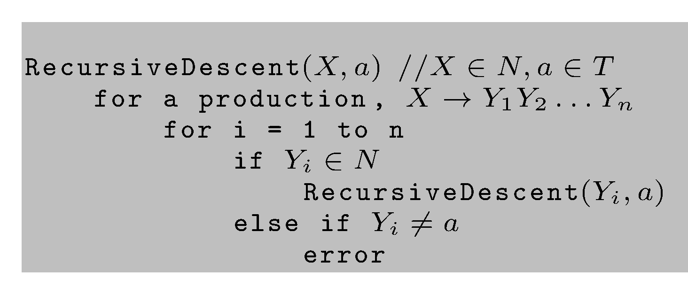
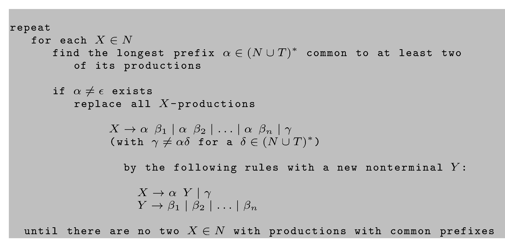
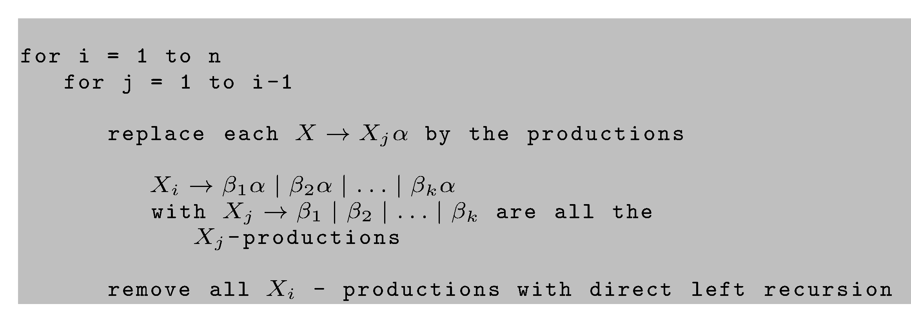

**TODO: Split in "CFG" und "LL-Parser (Theorie) => nur Master**

# Wiederholung

## Endliche Automaten. reguläre Ausdrücke, reguläre Grammatiken, reguläre Sprachen

*   Wie sind DFAs und NFAs definiert?
*   Was sind reguläre Ausdrücke?
*   Was sind formale und reguläre Grammatiken?
*   In welchem Zusammenhang stehen all diese Begriffe?
*   Wie werden DFAs und reguläre Ausdrücke im Compilerbau eingesetzt?

# Motivation

## Wofür reichen reguläre Sprachen nicht?

Für z. B. alle Sprachen, in deren Wörtern Zeichen über eine Konstante hinaus gezählt werden müssen. Diese Sprachen lassen sich oft mit Variablen im Exponenten beschreiben, die unendlich viele Werte annehmen können.

*    $a^ib^{2*i}$ ist nicht regulär
*    $a^ib^{2*i}$ für $0 \leq i \leq 3$ ist regulär

*    Wo finden sich die oben genannten Konstanten bei einem DFA wieder?
*    Warum ist die erste Sprache oben nicht regulär, die zweite aber?

## Themen für heute

*   PDAs: mächtiger als DFAs, NFAs
*   kontextfreie Grammatiken und Sprachen: mächtiger als reguläre Grammatiken und Sprachen
*   DPDAs und deterministisch kontextfreie Grammatiken: die Grundlage der Syntaxanalyse im Compilerbau
*   Der Einsatz kontextfreier Grammatik zur Syntaxanalyse mittels Top-Down-Techniken

## Einordnung: Erweiterung der Automatenklasse DFA, um komplexere Sprachen als die regulären akzeptieren zu können

Wir spendieren den DFAs einen möglichst einfachen, aber beliebig großen, Speicher, um zählen  und matchen zu können. Wir suchen dabei konzeptionell die "kleinstmögliche" Erweiterung, die die akzeptierte Sprachklasse gegenüber DFAs vergrößert.

*   Der konzeptionell einfachste Speicher ist ein Stack. Wir haben keinen wahlfreien Zugriff auf die gespeicherten Werte.
*   Es soll eine deterministische und eine indeterministische Variante der neuen Automatenklasse geben.
*   In diesem Zusammenhang wird der Stack auch Keller genannt.

## Kellerautomaten (Push-Down-Automata, PDAs)

**Def.:** Ein Kellerautomat (PDA) $P = (Q,\ \Sigma,\ \Gamma,\  \delta,\ q_0,\ \perp,\ F)$
ist ein Quintupel mit:

{width="60%"}

Ein PDA ist per Definition nichtdeterministisch und kann spontane Zustandsübergänge durchführen.

## Was kann man damit akzeptieren?

Strukturen mit paarweise zu matchenden Symbolen.

Bei jedem Zustandsübergang wird ein Zeichen (oder $\epsilon$) aus der Eingabe gelesen, ein Symbol von Keller genommen. Diese und das Eingabezeichen bestimmen den Folgezustand und eine Zeichenfolge, die auf den Stack gepackt wird. Dabei wird ein Symbol, das später mit einem Eingabesymbol zu matchen ist, auf den Stack gepackt.

## Beispiel

{width="45%"}

## Konfigurationen von PDAs

**Def.:** Eine Konfiguration (ID) eines PDAs 3-Tupel $(q, w, \gamma)$
mit

* $q$ ist ein Zustand
* $w$ ist der verbleibende Input, $w\in\Sigma^{\ast}$
* $\gamma$ ist der Kellerinhalt $\gamma\in \Gamma^{\ast}$

eines PDAs zu einem gegebenen Zeitpunkt.

## Die Übergangsrelation eines PDAs

**Def.:** Die Relation $\vdash$ definiert Übergänge von einer Konfiguration zu einer anderen:

Sei $(p, \alpha) \in \delta(q, a, X)$, dann gilt $\forall w\ \epsilon \ \Sigma^{\ast}$ und
$\beta \in \Gamma^{\ast}$:

$(q, aw, X\beta)\vdash(p, w, \alpha\beta)$.

\bigskip

**Def.:** Wir definieren mit $\overset{\ast}{\vdash}$ 0 oder endlich viele Schritte des PDAs
induktiv wie folgt:

*   Basis: $I\overset{\ast}{\vdash} I$ für eine ID $I$.
*   Induktion: $I\overset{\ast}{\vdash}J$, wenn $\exists$ ID $K$ mit $I\vdash K$ und $K \overset{\ast}{\vdash}J$.

## Eigenschaften der Konfigurationsübergänge

**Satz:** Sei $P=(Q, \Sigma, \Gamma, \delta, q_{0}, \perp, F)$ ein PDA und $(q, x,\alpha)\overset{\ast}{\vdash}
(p, y, \beta)$. Dann gilt für beliebige Strings $w\in\Sigma^{\ast}$, $\gamma$ in $\Gamma^{\ast}$:

$(q, xw, \alpha \gamma) \overset{\ast}{\vdash}(p, yw, \beta\gamma)$

**Satz:** Sei $P = (Q, \Sigma, \Gamma, \gamma, q_0, \perp, F)$ ein PDA und $(q,xw,\alpha) \overset{\ast}{\vdash}
(p,y w, \beta)$.

Dann gilt: $(q, x, a) \overset{\ast}{\vdash} (p, y, \beta)$

## Akzeptierte Sprachen

**Def.:** Sei $P=(Q, \Sigma, \Gamma, \delta, q_0, \perp, F)$ ein PDA. Dann ist die *über einen Endzustand*
akzeptierte Sprache $L(P) = \{w \mid (q_0, w, \perp) \overset{\ast}{\vdash} (q, \epsilon, \alpha)\}$
für einen Zustand $q \in F, \alpha \in \Gamma^{\ast}$.

**Def.:** Für einen PDA $P=(Q, \Sigma, \Gamma, \delta, q_{0}, \perp, F)$
definieren wir die über den *leeren Keller* akzeptierte Sprache
$N(P) = \{(w \mid (q_0, w, \perp) \overset{\ast}{\vdash} (q, \epsilon, \epsilon)\}$.

## Akzeptanzäquivalenzen

**Satz:** Wenn $L = N(P_N)$ für einen PDA $P_N$, dann gibt es einen PDA $P_L$ mit
$L = L(P_L)$.

**Satz:** Für einen PDA $P$ mit $\epsilon$-Transitionen existiert ein PDA $Q$ ohne
$\epsilon$-Transitionen mit $L(P) = N(P) = L(Q) = N(Q)$.

Die Transitionsfunktion $\delta$ ist dann von der Form
$\delta: Q \times \Sigma \times \Gamma \to2^{Q \times \Gamma^{\ast}}$.

## Deterministische PDAs

**Def.**  Ein PDA $P = (Q, \Sigma, \Gamma, \delta, q_0, \perp, F)$ ist *deterministisch*
$: \Leftrightarrow$

*   $\delta(q, a, X)$ hat höchstens ein Element für jedes $q \in Q, a \in\Sigma$ oder $(a = \epsilon$ und $X \in \Gamma)$.
*   Wenn $\delta (q, a, x)$ nicht leer ist für ein $a \in \Sigma$, dann muss $\delta (q, \epsilon, x)$ leer sein.

Deterministische PDAs werden auch *DPDAs* genannt.

## Der kleine Unterschied

**Satz:** Die von DPDAs akzeptierten Sprachen sind eine echte Teilmenge der von
PDAs akzeptierten Sprachen.

Die Sprachen, die von *regex* beschrieben werden, sind eine echte Teilmenge der von
DPDAs akzeptierten Sprachen.

# Kontextfreie Grammatiken und Sprachen

## Kontextfreie Grammatiken

**Def.**   Eine *kontextfreie (cf-)* Grammatik ist ein 4-Tupel $G = (N, T, P, S)$ mit *N, T, S* wie in
(formalen) Grammatiken und *P* ist eine endliche Menge von Produktionen der Form:

$X \rightarrow Y$ mit $X \in N, Y \in {(N \cup T)}^{\ast}$.

$\Rightarrow, \overset{\ast}{\Rightarrow}$ sind definiert wie bei regulären Sprachen. Bei cf-Grammatiken nennt man die Ableitungsbäume oft *Parse trees*.

## Beispiel

\vspace{-2.5cm}

$S \rightarrow a \mid S\ +\  S\ |\  S \ast S$

Ableitungsbäume für $a + a \ast a$:
\vfill

## Mehrdeutige Grammatiken

**Def.:** Gibt es in einer von einer kontextfreien Grammatik erzeugten Sprache ein
Wort, für das mehr als ein Ableitungsbaum existiert, so heißt diese Grammatik
*mehrdeutig*. Anderenfalls heißt sie *eindeutig*.

**Satz:** Es gibt kontextfreie Sprachen, für die keine eindeutige Grammatik existiert.

## Kontextfreie Grammatiken und PDAs

**Satz:** Die kontextfreien Sprachen und die Sprachen, die von PDAs akzeptiert werden, sind dieselbe
Sprachklasse.

**Satz:** Sei $L = N(P)$ für einen DPDA *P*, dann hat *L* eine eindeutige Grammatik.

**Def.:** Die Klasse der Sprachen, die von einem DPDA akzeptiert werden, heißt
Klasse der *deterministisch kontextfreien (oder LR(k)-) Sprachen*.

## Das Pumping Lemma für kontextfreie Sprachen

Wenn wir beweisen müssen, dass eine Sprache nicht cf ist, hilft das Pumping Lemma für cf-Sprachen:

**Satz:** Sei *L* eine kontextfreie Sprache

$\Rightarrow \exists$ eine Konstante $p \in \mathbb{N}$:

$\underset{\underset{|z| \geq p} {z \in L}}\forall \exists$ $u, v, w, x, y \in
\Sigma ^{\ast}$ mit $z = uvwxy$ und

*   $\mid vwx\mid \leq p$
*   $vx \neq \epsilon$
*   $\forall i \geq 0 : uv^i wx^i y \in L$

## Abschlusseigenschaften von kontextfreien Sprachen

**Satz:** Die kontextfreien Sprachen sind abgeschlossen unter:

*   Vereinigung
*   Konkatenation
*   Kleene-Hüllen $L^{\ast}$ und $L^+$

**Satz:** Wenn *L* kontextfrei ist, dann ist $L^R$ kontextfrei.

## Entscheidbarkeit von kontextfreien Grammatiken und Sprachen

**Satz:** Es ist entscheidbar für eine kontextfreie Grammatik *G*,

*   ob $L(G) = \emptyset$
*   welche Symbole nach $\epsilon$ abgeleitet werden können
*   welche Symbole erreichbar sind
*   ob $w  \in L(G)$ für ein gegebenes $w \in {\Sigma}^{\ast}$

**Satz:** Es ist nicht entscheidbar,

*   ob eine gegebene kontextfreie Grammatik eindeutig ist
*   ob der Durchschnitt zweier kontextfreier Sprachen leer ist
*   ob zwei kontextfreie Sprachen identisch sind
*   ob eine gegebene kontextfreie Sprache gleich $\Sigma^{\ast}$ ist

## Abschlusseigenschaften deterministisch kontextfreier Sprachen

**Satz:** Deterministisch kontextfreie Sprachen sind abgeschlossen unter

*   Durchschnitt mit regulären Sprachen
*   Komplement

Sie sind nicht abgeschlossen unter

*   Umkehrung
*   Vereinigung
*   Konkatenation

# Syntaxanalyse

## Syntax

Wir verstehen unter Syntax eine Menge von Regeln, die die Struktur von Daten (z. B. Programmen) bestimmen.

Syntaxanalyse ist die Bestimmung, ob Eingabedaten einer vorgegebenen Syntax entsprechen.

## Arten der Syntaxanalyse

Die Syntax bezieht sich auf die Struktur der zu analysierenden Eingabe, z. B. einem Computerprogramm in einer Hochsprache. Diese Struktur wird mit formalen Grammatiken beschrieben. Einsetzbar sind Grammatiken, die deterministisch kontextfreie Sprachen erzeugen.

*   Top-Down-Analyse: Aufbau des Parse trees von oben
    *   Parsen durch rekursiven Abstieg
    *   LL-Parsing
*   Bottom-Up-Analyse: LR-Parsing

## Mehrdeutigkeiten

Wir können nur mit eindeutigen Grammatiken arbeiten, aber:

**Def.:**  Eine formale Sprache  L heißt *inhärent mehrdeutige Sprache*, wenn jede formale Grammatik *G* mit $L(G) = L$ mehrdeutig ist.

Das heißt, solche Grammatiken existieren.

$\Rightarrow$ Es gibt keinen generellen Algorithmus, um Grammatiken eindeutig zu machen.

## Bevor wir richtig anfangen...

**Def.:** Ein Nichtterminal *A* einer kontextfreien Grammatik *G* heißt *unerreichbar*, falls es kein $a,b \in {(N \cup T)}^{\ast}$ gibt mit $S \overset{\ast}{\Rightarrow} aAb$. Ein Nichtterminal *A* einer Grammatik *G* heißt *nutzlos*, wenn es kein Wort  $w \in T^{\ast}$ gibt mit $A \overset{\ast}{\Rightarrow} w$.

**Def.:** Eine kontextfreie Grammatik $G=(N, T, P, S)$ heißt *reduziert*, wenn es keine nutzlosen oder unerreichbaren Nichtterminale in *N* gibt.

Bevor mit einer Grammatik weitergearbeitet wird, müssen erst alle nutzlosen und dann alle unerreichbaren Symbole eliminiert werden. Wir betrachten ab jetzt nur reduzierte Grammatiken.

# Top-Down-Analyse

##  Algorithmus: Rekursiver Abstieg

Hier ist ein einfacher Algorithmus, der (indeterministisch) einen Ableitungsbaum vom Nonterminal *X* von oben nach unten aufbaut:

**Eingabe:** Ein Nichtterminal $X$ und das nächste zu verarbeitende Eingabezeichen $a$.

{width="55%"}

## Grenzen des Algorithmus

Was ist mit

1) $X \rightarrow a \alpha \mid b \beta$
2) $X \rightarrow B\alpha \mid C \beta$
3) $X \rightarrow B \alpha \mid B \beta$
4) $X \rightarrow  B \alpha \mid C \beta$ und $C\rightarrow B$
5) $X \rightarrow X \beta$
6) $X \rightarrow B \alpha$ und $B \rightarrow X \beta$

\vspace{2cm}

$X, B, C, D \in N^{\ast};  a, b, c, d \in T^{\ast};  \beta$, $\alpha, \beta \in (N \cup T)^{\ast}$

## Linksfaktorisierung
$X \rightarrow BC\  \vert \  BD$
\vfill
\vfill

##  Algorithmus: Linksfaktorisierung

**Eingabe:** Eine  Grammatik G = (N, T, P, S)

**Ausgabe:** Eine äquivalente links-faktorisierte Grammatik $G'$

{width="85%"}

## Linksrekursion

**Def.:** Eine Grammatik $G=(N, T, P, S)$ heißt *linksrekursiv*, wenn sie ein Nichtterminal *X* hat, für das es eine Ableitung $X \overset{+}{\Rightarrow} X\ \alpha$ für ein $\alpha \in (N \cup T)^{\ast}$ gibt.

Linksrekursion gibt es

*direkt*: $X \rightarrow X \alpha$

und

*indirekt*: $X \rightarrow \ldots \rightarrow \ldots \rightarrow X \alpha$

##  Algorithmus: Entfernung von direkter Linksrekursion {.fragile}

**Eingabe:** Eine  Grammatik G = (N, T, P, S)

**Ausgabe:** Eine äquivalente Grammatik $G'$ ohne direkte Linksrekursion

{width="55%"}

##  Algorithmus: Entfernung von indirekter Linksrekursion {.fragile}

**Eingabe:** Eine  Grammatik G = (N, T, P, S)  mit $N= \{X_1, X_2, \ldots X_n\}$ ohne $\epsilon$-Regeln oder Zyklen der Form $X_1 \rightarrow X_2, X_2 \rightarrow X_3, \ldots X_{m-1} \rightarrow X_m, X_m \rightarrow X_1$

**Ausgabe:** Eine äquivalente Grammatik $G'$ ohne Linksrekursion

{width="60%"}

# Arbeiten mit generierten Parsern: LL(k)-Grammatiken

## First-Mengen

$S \rightarrow A \ \vert \ B \ \vert \ C$

Welche Produktion nehmen?

Wir brauchen die "terminalen k-Anfänge" von Ableitungen von Nichtterminalen, um eindeutig die nächste zu benutzende Produktion festzulegen. $k$ ist dabei die Anzahl der Vorschautoken.

**Def.:** Wir definieren $First$ - Mengen einer Grammatik wie folgt:

*   $a \in T^\ast, |a| \leq k: {First}_k (a) = \{a\}$
*   $a \in T^\ast, |a| > k: {First}_k (a) = \lbrace v \in T^\ast \mid a = vw, |v| = k\rbrace$
*   $A \in (N \cup T)^\ast \backslash T^\ast: {First}_k (A) = \lbrace v \in T^\ast \mid  A \overset{\ast}{\Rightarrow} w,\text{mit}\ w \in T^\ast*, First_k(w) = \lbrace v \rbrace \rbrace$

## Linksableitungen

**Def.:** Bei einer kontextfreien Grammatik $G$ ist die $Linksableitung$ von $\alpha \in (N \cup T)^{\ast}$ die Ableitung, die man erhält, wenn in jedem Schritt das am weitesten links stehende Nichtterminal in $\alpha$ abgeleitet wird.

Man schreibt $\alpha \overset{\ast}{\Rightarrow}_l \beta.$

## Follow-Mengen

Manchmal müssen wir wissen, welche terminalen Zeichen hinter einem Nichtterminal stehen können.

**Def.** Wir definieren *Follow* - Mengen einer Grammatik wie folgt:

$\forall \beta \in (N \cup T)^*:$

$Follow_k(\beta) = \lbrace w \in T^\ast \mid \exists \alpha, \gamma \in  (N \cup T)^\ast\ \text{mit}\
S \overset{\ast}{\Rightarrow}_l \alpha \beta \gamma\ \text{und}\ w \in First_k(\gamma) \rbrace$

## LL(k)-Grammatiken

**Def.:** Eine kontextfreie Grammatik *G = (N, T, P, S)* ist genau dann eine *LL(k)*-Grammatik, wenn für alle Linksableitungen der Form:

$S \overset{\ast}{\Rightarrow}_l\ wA \gamma\ {\Rightarrow}_l\ w\alpha\gamma \overset{\ast}{\Rightarrow}_l wx$

und

$S \overset{\ast}{\Rightarrow}_l wA \gamma {\Rightarrow}_l w\beta\gamma \overset{\ast}{\Rightarrow}_l wy$

mit $(w, x, y \in T^\ast, \alpha, \beta, \gamma \in (N \cup T)^\ast, A \in N)$ und $First_k(x) = First_k(y)$
gilt:

$\alpha = \beta$

## LL(k)-Grammatiken

Das hilft manchmal:

Für $k = 1$:
G ist $LL(1): \forall A \rightarrow \alpha, A \rightarrow \beta \in P, \alpha \neq \beta$ gilt:

1.  $\lnot \exists a \in T: \alpha  \overset{\ast}{\Rightarrow}_l  a\alpha_1$ und $\beta \overset{\ast}{\Rightarrow}_l a\beta_1$
2.  $((\alpha \overset{\ast}{\Rightarrow}_l \epsilon) \Rightarrow (\lnot (\beta \overset{\ast}{\Rightarrow}_l \epsilon)))$ und $((\beta \overset{\ast}{\Rightarrow}_l \epsilon) \Rightarrow (\lnot (\alpha\overset{\ast}{\Rightarrow}_l \epsilon)))$
3.  $((\beta \overset{\ast}{\Rightarrow}_l \epsilon)$ und $(\alpha \overset{\ast}{\Rightarrow}_l a\alpha_1)) \Rightarrow a \notin Follow(A)$
4.  $((\alpha \overset{\ast}{\Rightarrow}_l \epsilon)$ und $(\beta \overset{\ast}{\Rightarrow}_l a\beta_1)) \Rightarrow a \notin Follow(A)$

\bigskip

Die ersten beiden  Zeilen bedeuten:

$\alpha$ und $\beta$ können nicht beide $\epsilon$ ableiten,  $First_1(\alpha) \cap First_1(\beta) = \emptyset$

Die dritte und vierte Zeile bedeuten:

$(\epsilon \in First_1(\beta)) \Rightarrow (First_1(\alpha) \cap Follow_1(A) = \emptyset)$

$(\epsilon \in First_1(\alpha)) \Rightarrow (First_1(\beta) \cap Follow_1(A) = \emptyset)$

## LL(1)-Grammatiken

## LL(k)-Sprachen

Die von *LL(k)*-Grammatiken erzeugten Sprachen sind eine echte Teilmenge der deterministisch parsbaren Sprachen.

Die von *LL(k)*-Grammatiken erzeugten Sprachen sind eine echte Teilmenge der von *LL(k+1)*-Grammatiken erzeugten Sprachen.

Für eine kontextfreie Grammatik *G* ist nicht entscheidbar, ob es eine *LL(1)* - Grammatik *G'* gibt mit $L(G) = L(G')$.

In der Praxis reichen $LL(1)$ - Grammatiken oft. Hier gibt es effiziente Parsergeneratoren, deren Eingabe eine LL(k)- (meist LL(1)-) Grammatik ist, und die als Ausgabe den Quellcode eines (effizienten) tabellengesteuerten Parsers generieren.

##  Algorithmus: Konstruktion einer LL-Parsertabelle {.fragile}

**Eingabe:** Eine  Grammatik G = (N, T, P, S)

**Ausgabe:** Eine Parsertabelle *P*

{width="60%"}

Hier ist $\perp$ das Endezeichen des Inputs.
Statt $First_1(\alpha)$ und $Follow_1(\alpha)$ wird oft nur $First(\alpha)$ und $Follow(\alpha)$ geschrieben.

## LL-Parsertabellen

## LL-Parsertabellen

Rekursive Programmierung bedeutet, dass das Laufzeitsystem einen Stack benutzt (bei einem Recursive-Descent-Parser, aber auch bei der Parsertabelle). Diesen Stack kann man auch "selbst programmieren", d. h. einen PDA implementieren. Dabei wird ebenfalls die oben genannte Tabelle zur Bestimmung der nächsten anzuwendenden Produktion benutzt. Der Stack enthält die zu erwartenden Eingabezeichen, wenn immer eine Linksableitung gebildet wird. Diese Zeichen im Stack werden mit dem Input gematcht.

## Algorithmus: Tabellengesteuertes LL-Parsen mit einem PDA {.fragile}

**Eingabe:** Eine  Grammatik G = (N, T, P, S), eine Parsertabelle *P* mit $w\perp$ als initialem Kellerinhalt

**Ausgabe:** Wenn $w \in L(G)$,  eine Linksableitung von $w$, Fehler sonst

{width="50%"}

Der Eingabestring sei $w\perp$, der initiale Kellerinhalt sei $\perp$.

## Ergebnisse der Syntaxanalyse

*   eventuelle  Syntaxfehler mit Angabe der Fehlerart und des -Ortes
*   Fehlerkorrektur
*   Format für die Weiterverarbeitung:
    *   Syntaxbaum oder Parse Tree
    *   abstrakter Syntaxbaum (AST): Der Parse Tree ohne Symbole, die nach der Syntaxanalyse inhaltlich irrelevant sind (z. B. ;, Klammern, manche Schlüsselwörter, $\ldots$)
*   Symboltabelle

## Wrap-Up

*   Syntaxanalyse wird mit deterministisch kontextfreien Grammatiken durchgeführt.
*   Eine Teilmenge der dazu gehörigen Sprachen lässt sich top-down parsen.
*   Ein einfacher Recursive-Descent-Parser arbeitet mit Backtracking.
*   Ein effizienter LL(k)-Parser realisiert einen DPDA und kann automatisch aus einer LL(k)-Grammatik generiert werden.
*   Der Parser liefert in der Regel einen abstrakten Syntaxbaum.

<!-- DO NOT REMOVE - THIS IS A LAST SLIDE TO INDICATE THE LICENSE AND POSSIBLE EXCEPTIONS (IMAGES, ...). -->
::: slides
## LICENSE

Unless otherwise noted, this work is licensed under CC BY-SA 4.0.
:::
